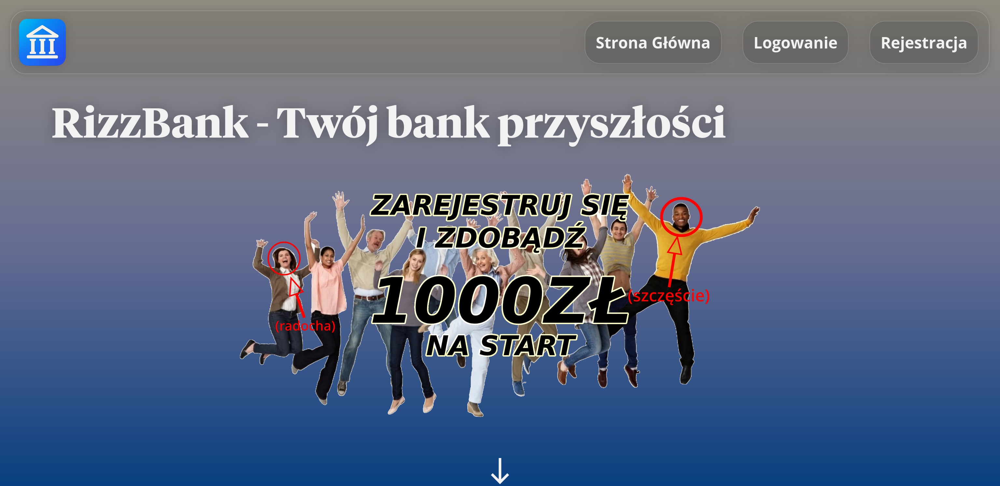
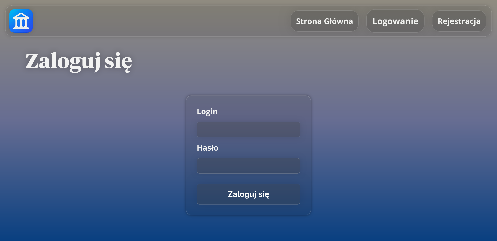
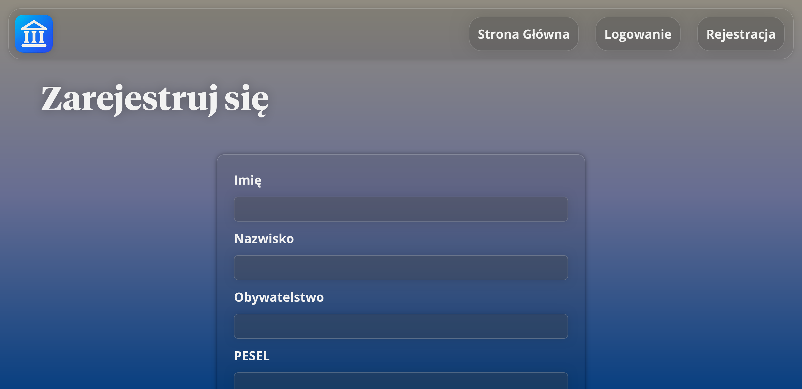
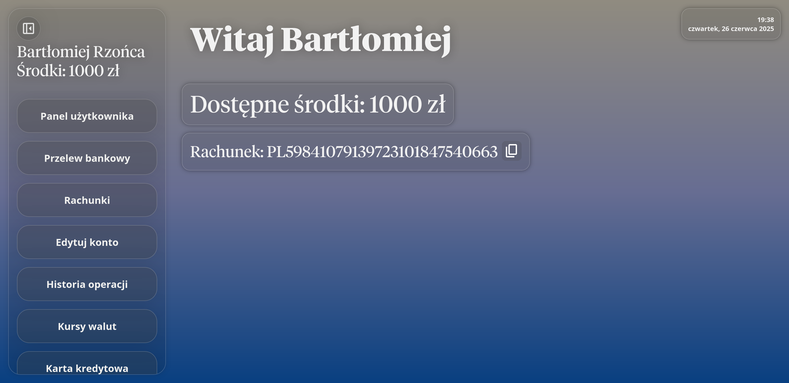
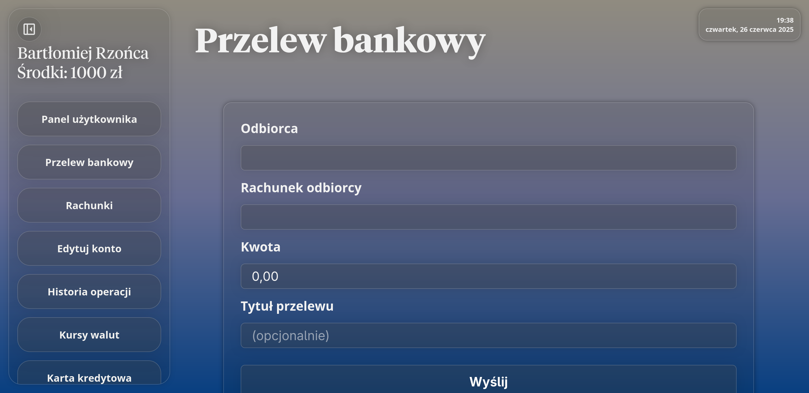
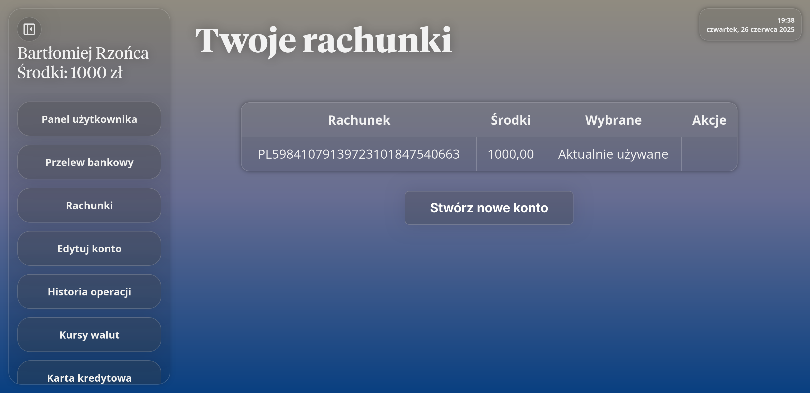
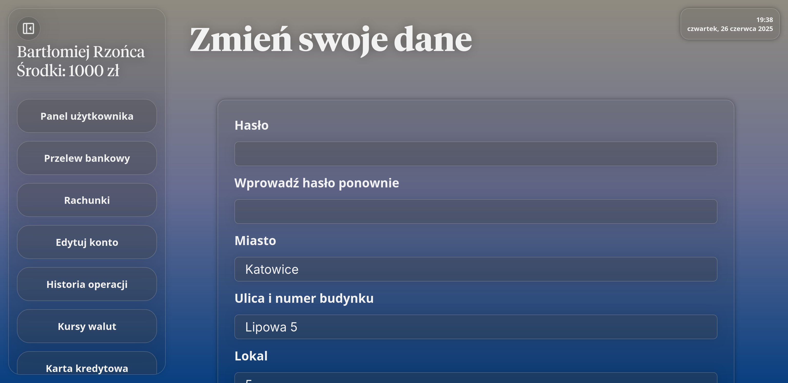
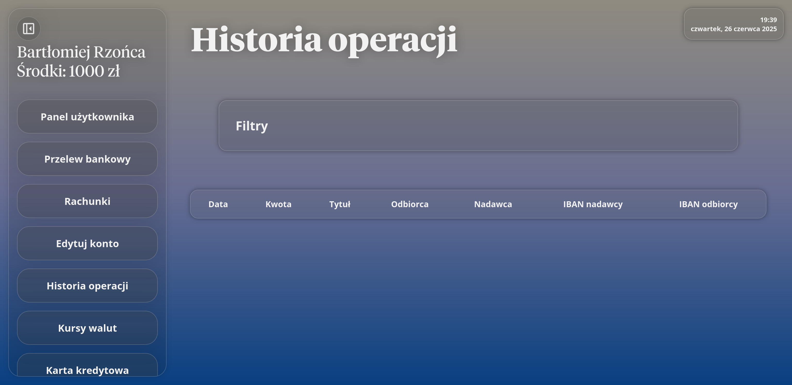
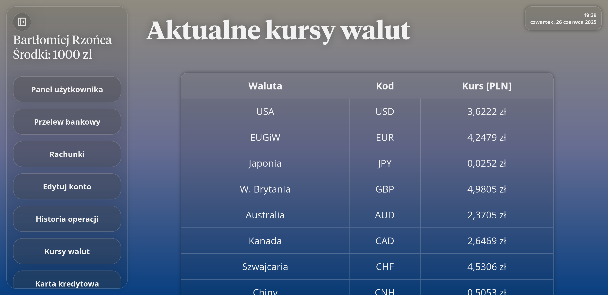
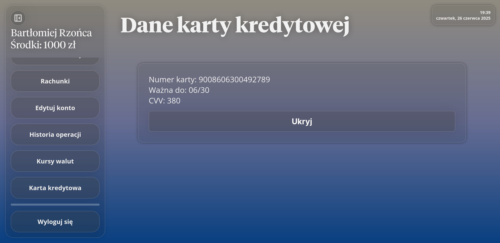

<h1 align="center"style="font-size: 5vw;">Aplikacja Bankowa<br />RizzBank</h1>
<br />
<p align="center">

</p>
<br />
<br />


Repozytorium projektu zaliczeniowego grupy 1 (Bartłomiej Rzońca & Łukasz Babik) – pełnoprawna, choć uproszczona, bankowość internetowa napisana w ASP.NET Core 8.0 z wykorzystaniem Razor Pages i Entity Framework Core.
Aplikacja pozwala utworzyć konto użytkownika, zalogować się, wykonywać przelewy, przeglądać historię operacji, sprawdzić bieżące kursy NBP oraz zarządzać danymi i kartą kredytową – wszystko za pomocą pojedynczej, lokalnej bazy SQLite.

---

<h2>📑 Spis treści</h2>

1. <a href="#funkcjonalnosci">Kluczowe funkcjonalności</a>
2. <a href="#technologie">Technologie i biblioteki</a>
3. <a href="#wymagania">Wymagania systemowe</a>
4. <a href="#instalacja">Instalacja krok po kroku</a>
5. <a href="#schemat">Schemat bazy danych</a>
6. <a href="#bezpieczenstwo">Bezpieczeństwo</a>
7. <a href="#paradygmaty">Paradygmaty obiektowe</a>
8. <a href="#rozwoj">Dalszy rozwój</a>
9. <a href="#bledy">Błędy i naprawy</a>
10. <a href="#kontrybucja">Kontrybucja</a>
11. <a href="#licencja">Licencja</a>
12. <a href="#autorzy">Autorzy</a>
13. <a href="#zrzuty">Zrzuty ekranu</a>

---

<h2 id="funkcjonalnosci">🏦 Kluczowe funkcjonalności</h2>

| Moduł                     | Opis                                                                                                                       |
| ------------------------- | -------------------------------------------------------------------------------------------------------------------------- |
| Rejestracja i logowanie   | Automatyczne nadawanie 8‑cyfrowego loginu, szyfrowanie haseł SHA‑256, walidacja danych i dwustopniowe potwierdzenie hasła. |
| Panel klienta (Dashboard) | Zestawienie salda, skrót ostatnich przelewów oraz szybkie linki do najczęściej używanych akcji.                            |
| Rachunki i saldo          | Widok wszystkich rachunków użytkownika, możliwość dodawania nowych.                                                         |
| Przelewy wychodzące       | Wysyłanie środków na dowolny numer IBAN, walidacja kwot (2 miejsca po przecinku, zakres 0,01 – 1 000 000 000 PLN).           |
| Historia operacji         | Podgląd przelewów z filtrowaniem po dacie, kwocie lub tytule.                                                              |
| Kursy walut               | Scrapowane z Bankier.pl – aktualna tabela najpopularniejszych walut w Polsce według NBP (USD, EUR, GBP, CHF …) odświeżane przy każdym wejściu. |
| Karta kredytowa           | Automatyczne generowanie numeru, daty ważności i CVV; wyświetlane w postaci maskowanej. Aby wyświetlić informacje o karcie, klient musi wprowadzić hasło. |
| Zmiana danych osobowych   | Edycja wybranych pól profilu z pełną ponowną walidacją.                                                                    |
| Wylogowanie / sesje       | Sesje oparte na cookie (CookieAuthentication) z wygaszaniem po 30 minutach bezczynności.                                   |
| HTTPS                     | Kestrel nasłuchuje na https://localhost:5001 z automatycznie wygenerowanym certyfikatem deweloperskim.                     |

---

<h2 id="technologie">🔧 Technologie i biblioteki</h2>

| Warstwa    | Stos technologiczny                                                                                       |
| ---------- | --------------------------------------------------------------------------------------------------------- |
| Backend    | .NET 8.0, ASP.NET Core Razor Pages, C# 12                                                                 |
| ORM        | Entity Framework Core 8 (provider SQLite)                                                                 |
| Frontend   | Razor + w stu procentach autorskie CSS oraz JavaScript                                                    |
| Pomocnicze | HtmlAgilityPack (waluty), Humanizer (formatowanie dat), System.ComponentModel.DataAnnotations (walidacja) |
| Dev tools  | JetBrains Rider, DB Browser for SQLite / JetBrains DataGrip                                               |

---

<h2 id="wymagania">✅ Wymagania systemowe</h2>

* .NET SDK 8.0 lub nowszy  
* System Windows 10/11, GNU/Linux lub macOS  
* Przeglądarka obsługująca TLS 1.3 (Chrome, Edge, Firefox ≥ ESR 115, Safari 16+)  
* Opcjonalnie: SQLite Browser lub sqlite3 w CLI, jeśli chcesz zajrzeć do bazy Database.db.

---

<h2 id="instalacja">🚀 Instalacja krok po kroku</h2>

1. Otwórz Powershell (Windows) lub Terminal (GNU/Linux/macOS).

2. Sklonuj repozytorium za pomocą polecenia:

```
git clone https://github.com/Rzoncik/BartlomiejRzonca_LukaszBabik_Grupa1_AplikacjaBankowa.git
```

3. Przejdź do katalogu wykonawczego programu:

```
cd BartlomiejRzonca_LukaszBabik_Grupa1_AplikacjaBankowa/BankApp
```

4. Przywróć zależności NuGet za pomocą polecenia:

```
dotnet restore
```

5. Włącz aplikację za pomocą polecenia:

```
dotnet run
```

6. Po kilku sekundach aplikacja będzie dostępna pod adresem:

```
https://localhost:5001
```

---

<h2 id="schemat">🗄 Schemat bazy danych</h2>

<h3>Users</h3>

| Kolumna                                           | Typ           | Uwagi                                                |
| ------------------------------------------------- | ------------- | ---------------------------------------------------- |
| UserId                                            | INTEGER (PK)  | auto‑increment                                       |
| Login                                             | TEXT(8)       | unikalny                                             |
| Password                                          | TEXT          | SHA‑256                                              |
| Balance                                           | DECIMAL(18,2) | domyślnie 1000.00                                    |
| Iban                                              | TEXT(28)      | PL + 26 cyfr                                         |
| CreditCardNumber, CreditCardExpiry, CreditCardCvv | TEXT          | generowane                                           |
| …                                                 |               | imię, nazwisko, PESEL, dowód, adres, e‑mail, telefon |

<h3>Transfers</h3>

| Kolumna | Typ | Uwagi |
|---------|-----|-------|
| TransferId | INTEGER (PK) |
| SenderUserId 🔗, ReceiverUserId 🔗 | INTEGER | FK → Users.UserId |
| SenderIban, ReceiverIban | TEXT(28) |
| Amount | DECIMAL(18,2) | walidacja 0,01 – 1 000 000 000 |
| ReceiversName | TEXT |
| Title | TEXT | opcjonalny tytuł przelewu |
| ExecutedAtUtc | DATETIME | domyślnie DateTime.UtcNow |

---

<h2 id="bezpieczenstwo">🔐 Bezpieczeństwo</h2>

* Szyfrowanie haseł – hash SHA‑256 (bez soli, do ulepszenia)  
* Walidacja danych – atrybuty DataAnnotations (regexy, zakresy, długości)  
* Sesje i autoryzacja – CookieAuthentication + atrybut [Authorize]  
* HTTPS w localhost – automatyczny certyfikat deweloperski  
* Ochrona CSRF – wbudowana w Razor Pages (asp-antiforgery)

---

<h2 id="paradygmaty">🖥️ Paradygmaty obiektowe</h2>

<h3>1. Struktura klas</h3>

Klasa PasswordHelper jest wykorzystywana w różnych miejscach kodu programu. Dzięki temu kod programu jest czytelniejszy.

```
public static class PasswordHelper
    {
        // Tutaj hasło jest szyfrowane za pomocą SHA256.
        public static string HashPassword(string password)
        {
            using (SHA256 sha256 = SHA256.Create())
            {
                byte[] bytes = Encoding.UTF8.GetBytes(password);
                byte[] hashBytes = sha256.ComputeHash(bytes);

                StringBuilder builder = new StringBuilder();
                foreach (var b in hashBytes)
                {
                    builder.Append(b.ToString("x2"));
                }

                return builder.ToString();
            }
        }
    }
```

<h3>2. Paradygmat dziedziczenia</h3>

Klasa BaseUserPageModel dziedziczy cechy klasy PageModel. Dziedzicząca klasa jest wykorzystywana na stronach po zalogowaniu użytkownika np. /Dashboard lub /SendTransfer.

```
public abstract class BaseUserPageModel(AppDbContext db) : PageModel
    {
        protected AppDbContext context => db;
        
        public int? CurrentUserId => HttpContext.Session.GetInt32("UserId");
        
        protected IActionResult? RedirectIfNotLoggedIn()
            => CurrentUserId is null ? RedirectToPage("/Login") : null;
        
        protected Task<DbUsers> GetCurrentUserAsync()
            => context.Users.SingleAsync(u => u.UserId == CurrentUserId);
        
        [TempData]
        public string? ToastMessage { get; set; }
    }
```

<h3>3. Paradygmat hermetyzacji oraz polimorfizmu</h3>

Klasa private ukrywa swoją zawartość przed innymi obiektami.

```
        private abstract class TransferProcessor(
            AppDbContext db,
            DbUsers sender,
            string receiverIban,
            decimal amount,
            string receiversName,
            string? title)
        {
            protected readonly AppDbContext Db = db;
            protected readonly DbUsers Sender = sender;
            protected readonly string ReceiverIban = receiverIban;
            protected readonly decimal Amount = amount;
            protected readonly string ReceiversName = receiversName;
            protected readonly string? Title = title;
........
```

Polimorfizm pozwala na rozbudowę, w tym przypadku, o kolejne typy przelewów bankowych tj. BLIK.

```
........
private sealed class InternalTransferProcessor(
            AppDbContext db,
            DbUsers sender,
            string receiverIban,
            decimal amount,
            string receiversName,
            string? title) : TransferProcessor(db, sender, receiverIban, amount, receiversName, title)
        {
            private DbUsers? _receiver;

            protected override async Task<ValidationResult?> ValidateAsync()
            {
                _receiver = await Db.Users.SingleOrDefaultAsync(u => u.Iban == ReceiverIban);
                if (_receiver is null)
                    return new ValidationResult("W naszym banku nie ma konta o takim IBAN.", [nameof(SendTransferModel.ReceiverIban)]
                    );


                if (_receiver.UserId == Sender.UserId)
                    return new ValidationResult("Nie możesz wysłać przelewu na własne konto.", [nameof(SendTransferModel.ReceiverIban)]);
                    

                if (Sender.Balance < Amount)
                    return new ValidationResult("Niewystarczające środki.", [nameof(SendTransferModel.Amount)]);

                return null;
            }
```

<h3>4. Interfejsy</h3>

Interfejs IActionResult reprezentuje wynik działania metody strony np. OnGet, OnPost. Daje odpowiedź, którą serwer zwróci użytkownikowi po wykonaniu akcji.

```
public async Task<IActionResult> OnPostAsync()
        {
            if (!ModelState.IsValid) return Page();

            RedirectIfNotLoggedIn();
........
```

<h3>5. Biblioteki</h3>

Biblioteki to zestawy gotowych klas, metod, interfejsów i innych elementów.

```
using System.Globalization;

var qty = int.Parse(m.Groups["qty"].Value, CultureInfo.InvariantCulture);

var nbp = decimal.Parse(m.Groups["rate"].Value.Replace(',', '.'), CultureInfo.InvariantCulture);
```

---

<h2 id="rozwoj">🚶‍➡️ Dalszy rozwój</h2>

<h3>Przelewy BLIK</h3>

Zamierzamy dodać opcję przelewów na numer telefonu BLIK, aby wspierać nasz ojczysty rynek i przede wszystkim ułatwić życie finansowe naszym klientom.

<h3>Konta walutowe</h3>

Wielu klientów domaga się tej funkcjonalności. Z pewnością wielu użytkowników z tego skorzysta, aby zarabiać na wahaniach walut.

<h3>Przelewy pomiędzy różnymi kontami bankowymi, należącymi do jednego użytkownika</h3>

Jest to błąd, który zamierzamy naprawić.

---

<h2 id="bledy">🛠️ Błędy i naprawy</h2>

* Jetbrains Rider źle wysyłał commity na Github. Naprawiono to poprzez używanie aplikacji Github Desktop.

* Przy tworzeniu aplikacji, klasy przechowywane w katalogu /Helpers pisaliśmy kilkukrotnie w plikach programu co powodało nieprzejrzystość kodu. Naprawiono to poprzez stworzenie klas publicznych w wyżej wymienionym katalogu /Helpers.

* Przy ustalaniu interfejsu aplikacji postawiliśmy na WinForms, lecz później uznaliśmy że aplikacja webowa z frameworkiem Razor Pages bardziej pasuje do aplikacji bankowej i nie wymaga od użytkownika instalacji osobnego programu.

* Chcieliśmy użyć Microsoft Access jako fundament bazy danych. Z czasem uznaliśmy że to zły pomysł, ponieważ baza Access działa lokalnie i korzysta ze ścieżek absolutnych, dlatego postawiliśmy na prostą bazę danych działającą na silniku SQL.   

---

<h2 id="kontrybucja">🤝 Kontrybucja</h2>

1. Otwórz Issue opisujące błąd lub proponowaną funkcję  
2. Utwórz gałąź feature/nazwa albo bugfix/nazwa  
3. Przed pull-requestem uruchom:

```bash
dotnet build
dotnet format
```

---

<h2 id="licencja">📜 Licencja</h2>

Repozytorium nie zawiera pliku licencji głównej.  
Jeśli chcesz wykorzystać kod we własnym projekcie, skontaktuj się z autorami lub dodaj plik LICENSE (np. MIT / Apache 2.0) przed dalszą dystrybucją.

---

<h2 id="autorzy">👥 Autorzy</h2>

| Imię i nazwisko   | Rola           | Kontakt                    |
| ----------------- | -------------- | -------------------------- |
| Bartłomiej Rzońca | Full‑stack Dev | rzoncabartlomiej@gmail.com |
| Łukasz Bąbik      | Full‑stack Dev | lbabik2003@gmail.com       |

Projekt wykonany w ramach zajęć Programowanie obiektowe (sem.2)AK1 – semestr 2024/25.
Debugowany na Fedora Workstation 42 z przeglądarką Brave oraz Windows 11 z Opera.
Dziękujemy za zainteresowanie. Jeśli masz pytania lub sugestie, otwórz Issue – chętnie pomożemy.

---

<h2 id="zrzuty">📷 Zrzuty ekranu</h2>




















