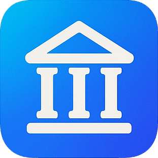

<h1 align="center"style="font-size: 5vw;">Aplikacja Bankowa<br />RizzBank</h1>
<section style="text-align: center;">

</section>


Repozytorium projektu zaliczeniowego grupy 1 (Bartłomiej Rzońca & Łukasz Babik) – pełnoprawna, choć uproszczona, bankowość internetowa napisana w ASP.NET Core 8.0 z wykorzystaniem Razor Pages i Entity Framework Core.
Aplikacja pozwala utworzyć konto użytkownika, zalogować się, wykonywać przelewy, przeglądać historię operacji, sprawdzić bieżące kursy NBP oraz zarządzać danymi i kartą kredytową – wszystko za pomocą pojedynczej, lokalnej bazy SQLite.

---

<h2>📑 Spis treści</h2>

1. <a href="#funkcjonalnosci">Kluczowe funkcjonalności</a>
2. <a href="#technologie">Technologie i biblioteki</a>
3. <a href="#wymagania">Wymagania systemowe</a>
4. <a href="#instalacja">Instalacja krok po kroku</a>
5. <a href="#struktura">Struktura katalogów</a>
6. <a href="#schemat">Schemat bazy danych</a>
7. <a href="#bezpieczenstwo">Bezpieczeństwo</a>
8. <a href="#kontrybucja">Kontrybucja</a>
9. <a href="#licencja">Licencja</a>
10. <a href="#autorzy">Autorzy</a>

---

<h2 id="funkcjonalnosci">🏦 Kluczowe funkcjonalności</h2>

| Moduł                     | Opis                                                                                                                       |
| ------------------------- | -------------------------------------------------------------------------------------------------------------------------- |
| Rejestracja i logowanie   | Automatyczne nadawanie 8‑cyfrowego loginu, szyfrowanie haseł SHA‑256, walidacja danych i dwustopniowe potwierdzenie hasła. |
| Panel klienta (Dashboard) | Zestawienie salda, skrót ostatnich przelewów oraz szybkie linki do najczęściej używanych akcji.                            |
| Rachunki i saldo          | Widok wszystkich kont (na razie pojedyncze konto PLN z możliwością rozszerzenia).                                          |
| Przelewy wychodzące       | Wysyłanie środków na dowolny numer IBAN, walidacja kwot (2 miejsca po przecinku, zakres 0,01 – 1 000 000 000 PLN).         |
| Historia operacji         | Paginowany podgląd przelewów z filtrowaniem po dacie lub tytule.                                                           |
| Kursy walut               | Web‑scraping z Bankier.pl – aktualne tabele NBP (USD, EUR, GBP, CHF …) odświeżane przy każdym wejściu.                     |
| Karta kredytowa           | Automatyczne generowanie numeru, daty ważności i CVV; wyświetlane w postaci maskowanej.                                    |
| Zmiana danych osobowych   | Edycja wybranych pól profilu z pełną ponowną walidacją.                                                                    |
| Wylogowanie / sesje       | Sesje oparte na cookie (CookieAuthentication) z wygaszaniem po 30 minutach bezczynności.                                   |
| HTTPS                     | Kestrel nasłuchuje na https://localhost:5001 z automatycznie wygenerowanym certyfikatem deweloperskim.                     |

---

<h2 id="technologie">🔧 Technologie i biblioteki</h2>

| Warstwa    | Stos technologiczny                                                                                       |
| ---------- | --------------------------------------------------------------------------------------------------------- |
| Backend    | .NET 8.0, ASP.NET Core Razor Pages, C# 12                                                                 |
| ORM        | Entity Framework Core 8 (provider SQLite)                                                                 |
| Frontend   | Razor + Bootstrap 5 (via libman) + minimalne CSS w *.cshtml.css                                           |
| Pomocnicze | HtmlAgilityPack (waluty), Humanizer (formatowanie dat), System.ComponentModel.DataAnnotations (walidacja) |
| Dev tools  | Visual Studio 2022 / Rider / VS Code + C# extensions                                                      |

---

<h2 id="wymagania">✅ Wymagania systemowe</h2>

* .NET SDK 8.0 lub nowszy  
* System Windows 10/11, Linux lub macOS  
* Przeglądarka obsługująca TLS 1.3 (Chrome, Edge, Firefox ≥ ESR 115, Safari 16+)  
* Opcjonalnie: SQLite Browser lub sqlite3 w CLI, jeśli chcesz zajrzeć do bazy Database.db.

---

<h2 id="instalacja">🚀 Instalacja krok po kroku</h2>
1. Otwórz Powershell (Windows) lub Terminal (GNU/Linux/macOS).
2. Sklonuj repozytorium za pomocą polecenia:

```
git clone https://github.com/Rzoncik/BartlomiejRzonca_LukaszBabik_Grupa1_AplikacjaBankowa.git
```

3. Przejdź do katalogu wykonawczego programu:

```
cd BartlomiejRzonca_LukaszBabik_Grupa1_AplikacjaBankowa/BankApp
```

4. Przywróć zależności NuGet za pomocą polecenia:

```
dotnet restore
```

5. Włącz aplikację za pomocą polecenia:

```
dotnet run
```

6. Po kilku sekundach aplikacja będzie dostępna pod adresem:

```
https://localhost:5001
```

---

<h2 id="struktura">🗂 Struktura katalogów</h2>
BankApp
├── Helpers/              # statyczne klasy pomocnicze
├── Models/               # POCO + AppDbContext (Users, Transfers)
├── Pages/                # Razor Pages (*.cshtml + code-behind)
│   ├── Shared/           # wspólne układy _Layout oraz _DashboardLayout
│   └── ...               # Login, Register, Dashboard, SendTransfer, ...
├── Program.cs            # minimal hosting + konfiguracja usług
├── Database.db           # lokalna baza SQLite
└── BankApp.csproj        # definicja projektu

---

<h2 id="schemat">🗄 Schemat bazy danych</h2>

<h3>Users</h3>

| Kolumna                                           | Typ           | Uwagi                                                |
| ------------------------------------------------- | ------------- | ---------------------------------------------------- |
| UserId                                            | INTEGER (PK)  | auto‑increment                                       |
| Login                                             | TEXT(8)       | unikalny                                             |
| Password                                          | TEXT          | SHA‑256                                              |
| Balance                                           | DECIMAL(18,2) | domyślnie 1000.00                                    |
| Iban                                              | TEXT(28)      | PL + 26 cyfr                                         |
| CreditCardNumber, CreditCardExpiry, CreditCardCvv | TEXT          | generowane                                           |
| …                                                 |               | imię, nazwisko, PESEL, dowód, adres, e‑mail, telefon |

<h3>Transfers</h3>

| Kolumna | Typ | Uwagi |
|---------|-----|-------|
| TransferId | INTEGER (PK) |
| SenderUserId 🔗, ReceiverUserId 🔗 | INTEGER | FK → Users.UserId |
| SenderIban, ReceiverIban | TEXT(28) |
| Amount | DECIMAL(18,2) | walidacja 0,01 – 1 000 000 000 |
| ReceiversName | TEXT |
| Title | TEXT | opcjonalny tytuł przelewu |
| ExecutedAtUtc | DATETIME | domyślnie DateTime.UtcNow |

---

<h2 id="bezpieczenstwo">🔐 Bezpieczeństwo</h2>

* Szyfrowanie haseł – hash SHA‑256 (bez soli, do ulepszenia)  
* Walidacja danych – atrybuty DataAnnotations (regexy, zakresy, długości)  
* Sesje i autoryzacja – CookieAuthentication + atrybut [Authorize]  
* HTTPS w localhost – automatyczny certyfikat deweloperski  
* Ochrona CSRF – wbudowana w Razor Pages (asp-antiforgery)

---

<h2 id="kontrybucja">🤝 Kontrybucja</h2>

1. Otwórz Issue opisujące błąd lub proponowaną funkcję  
2. Utwórz gałąź feature/nazwa albo bugfix/nazwa  
3. Przed pull-requestem uruchom:

```bash
dotnet build
dotnet format
```

4. PR powinien zawierać czytelny opis zmian, powiązany numer Issue, przechodzić dotnet build --configuration Release i nie powodować regresji funkcjonalności

Standard commitów – Conventional Commits (feat:, fix:, refactor: …).  
Style C# – pakiet reguł Microsoft.CodeAnalysis + .editorconfig repozytorium.

---

<h2 id="licencja">📜 Licencja</h2>

Repozytorium nie zawiera pliku licencji głównej.  
Jeśli chcesz wykorzystać kod we własnym projekcie, skontaktuj się z autorami lub dodaj plik LICENSE (np. MIT / Apache 2.0) przed dalszą dystrybucją.

---

<h2 id="autorzy">👥 Autorzy</h2>

| Imię i nazwisko   | Rola           | Kontakt                    |
| ----------------- | -------------- | -------------------------- |
| Bartłomiej Rzońca | Full‑stack Dev | rzoncabartlomiej@gmail.com |
| Łukasz Bąbik      | Full‑stack Dev | lbabik2003@gmail.com       |

Projekt wykonany w ramach zajęć Programowanie obiektowe (sem.2)AK1 – semestr 2024/25.
Dziękujemy za zainteresowanie. Jeśli masz pytania lub sugestie, otwórz Issue – chętnie pomożemy.
